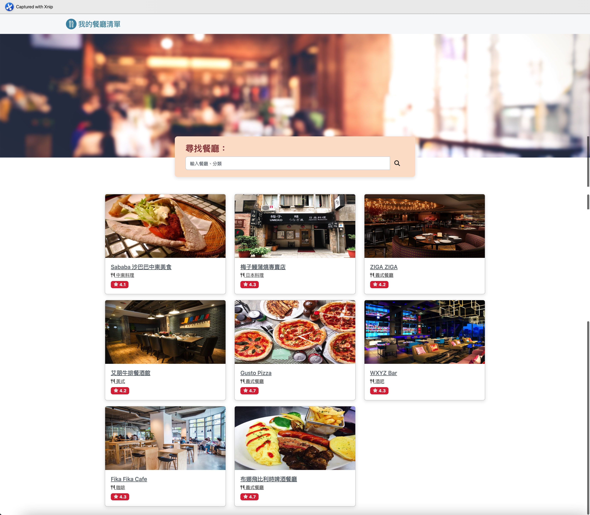
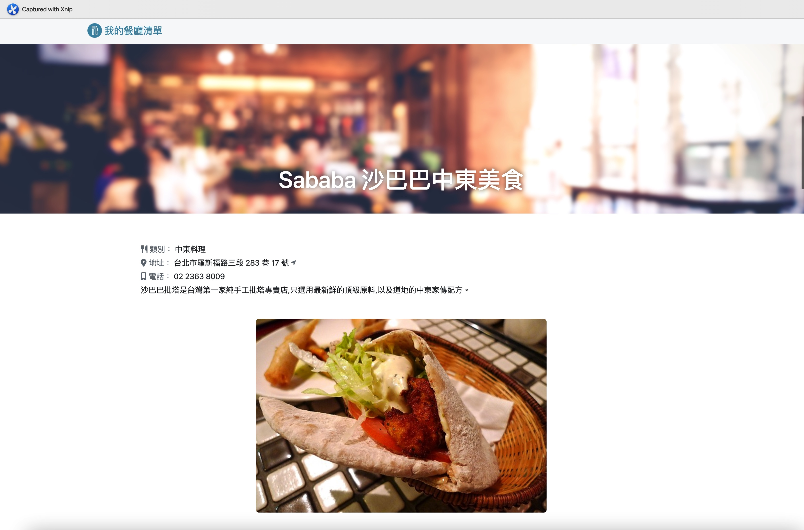
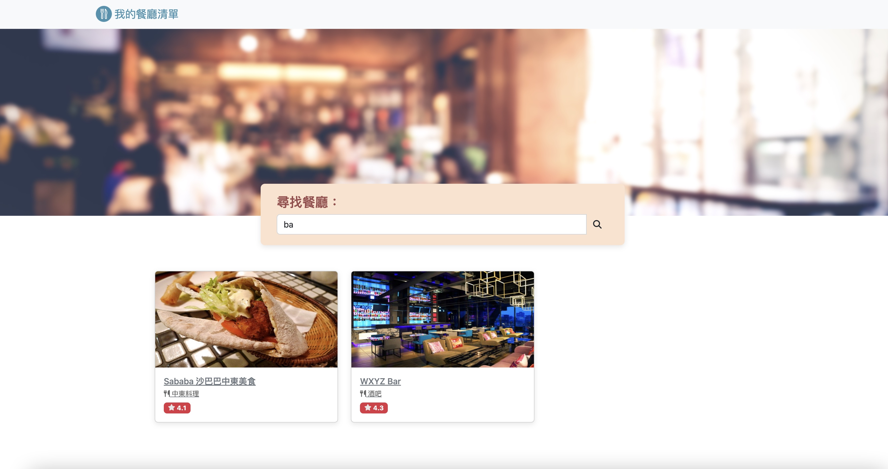
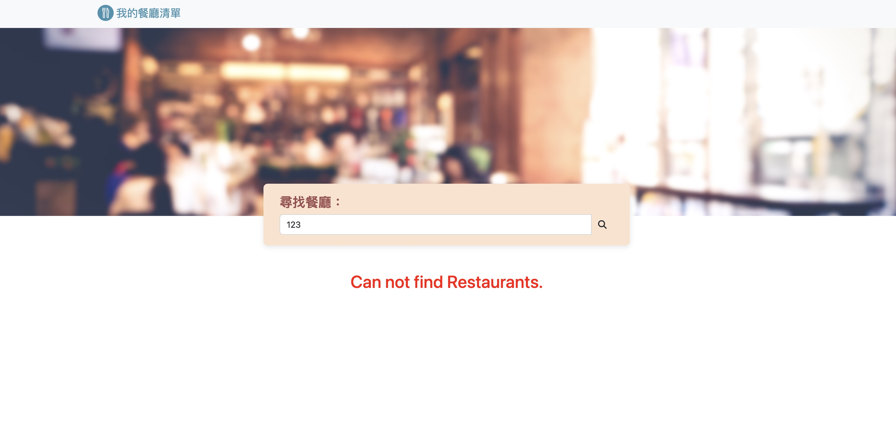

# AC-2-3-A1 Restaurant-List

Restaurant list created using node.js with package express.






## Features

- List all restaurants.
- Show restaurant detail.
- Search restaurant by name or category

## How to use

1. Clone the Repo to local server.
2. Install need package by follow cmd.
    ```bash
    npm isntall
    ```
3. Start server for demo.
    ```bash
    npm run dev
    ```
4. While see the message below, Open the browser and enter the following URL. 
    ```bash
    Listen on http://localhost:3000
    ```
5. Stop server
    ```bash
    cmd + c
    ```

## Built with

- Node.js: 18.15.0
- Express: 4.18.2
- Express-Handlebars: 7.0.7
- Bootstrap: 5.2.1
- Font-Awesome: 5.8.1